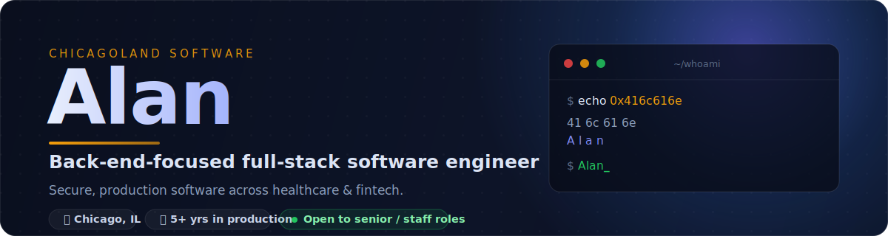

<!--
  GitHub profile README for user 0x416c616e (Alan).
  This file lives in a repo named exactly the same as the username (0x416c616e),
  which GitHub renders at the top of the profile page.
  Content sourced from https://chicagolandsoftware.com/
  Section-header + banner artwork are self-contained SVGs in ./assets (no external services).
-->

 

 

I'm a **back-end-focused full-stack software engineer** with **5+ years** building, securing, and maintaining production applications. Most recently I built clinical web apps and reporting automation for a healthcare provider running **100+ skilled-nursing facilities**.

- 🔭 Building **Chicago Capital Research** — an AI-assisted investment-research platform.
- 🗳️ Volunteering as a **senior engineer at WeVote**, a nonpartisan nonprofit reaching ~150K users.
- 🔐 A little obsessive about the parts of a system you're not supposed to notice — **security, data, and uptime**.
- 🌱 Continual learner: I pick up new languages, frameworks, and tools quickly and build side projects to stay sharp.

> *Back end at heart — comfortable across the stack, and serious about the boring parts.*

|  |  |  |  |
|:--:|:--:|:--:|:--:|
| **5+** yrs in production | **100+** facilities supported | **~150K** users reached (WeVote) | **20+** APIs integrated |

 

**Languages**

**Back End**

**Front End**

**Data & Reporting**

**Cloud & DevOps**

-232F3E?style=flat-square&logo=amazon&logoColor=FF9900)

**Security**

**AI**

**Practices**

 

### ⭐ Chicago Capital Research &nbsp;·&nbsp; *AI-assisted investment research*

An AI-assisted platform that turns raw market data, news, and SEC filings into **automated, analyst-grade research reports** and Bloomberg-style dashboards.

- 📊 Research pipeline ingests market data, fundamentals, technicals, news, and SEC filings from **6+ financial providers**, then scores each company with numeric ratio analysis and AI news sentiment.
- 🧩 Customizable **drag-and-drop dashboards** with charts & KPI widgets, a rotating "wall-monitor" mode, and on-demand + scheduled **PDF/HTML report** generation with email delivery.
- ⚛️ **React 19 + Vite** SPA shipping to **web and Android** (Capacitor) from one codebase, backed by an **Express 5 + PostgreSQL** API with cron-driven pipelines.
- 🔒 Production-grade security: **argon2id + JWT** auth, RBAC, Helmet/CSRF/WAF rules, rate limiting, replicated backups, monitoring, and a **~900-test** suite.

`React` `Vite` `Capacitor` `Node.js` `Express` `PostgreSQL` `OpenAI` `Cron` `JWT / argon2` `Puppeteer` `Recharts` &nbsp;·&nbsp; 🔒 *Private — reach out for a walkthrough.*

---

| Project | What it is | Stack | |
|---|---|---|:--:|
| **MTS2 — Metrics & Tracking System 2** | Healthcare app for data entry, reporting, dashboards, resident/medication/incident tracking across 100+ facilities. | Java · Spring Boot · Angular · T-SQL · AWS | 🔒 |
| **AI Message Queue** | Message-queue system letting multiple AI agents collaborate & share context via an issue tracker + wiki, enabling parallel work. | Multi-Agent · Message Queue · Knowledge Base | 🔒 |
| **Email Outreach Agent** | Autonomous, goal-driven outreach engine — discovers orgs via web crawl, uses AI to vet relevance, drafts & sends compliant emails, surfaces only replies needing a human. | Node.js · Express · PostgreSQL · Puppeteer · Claude API | 🔒 |
| **Scribble Slop** | AI art tool that paints hyper-detailed images *inside* your exact crude outlines, with a two-stage AI moderation gate. | React · Node · Express · PostgreSQL · OpenAI | 🔒 |
| **GainzPlanner** | AI workout planner — describe a workout in plain English; it infers muscle groups, queries an exercise DB, and builds a routine. | React · Node · Express · PostgreSQL · OpenAI | [🌐](https://gainzplanner.ai/) |
| **3D Multiplayer Game Engine** | Browser-based real-time multiplayer 3D engine (client + server): A* pathfinding, server-side validation, game ticks, scoped WebSocket updates. | React · TypeScript · Three.js · Node · WebSockets | 🔒 |
| **2D MMO Engine** | Browser 2D MMORPG engine with tile-based movement & collision, plus a desktop JSON map editor. | Angular · Java · Spring Boot · JavaFX | [💻](https://github.com/0x416c616e/2drpggamengine) |
| **AdiaScript** | A from-scratch scripting language + IDE for automating keyboard/mouse input — custom interpreter and editor. | Java · Language Design · Interpreters | [💻](https://github.com/0x416c616e/AdiaScript) |
| **EZcrypt** | Desktop file-encryption tool with a simple GUI (Blowfish) for protecting sensitive files. | Java · JavaFX · Encryption | [💻](https://github.com/0x416c616e/ezcrypt) |
| **Free Coding Tutorials** | A ~200,000-word library of programming tutorials: Java, Python, C++, security, DSA, cloud, and more. | Technical Writing · Full Stack | [🌐](https://freecodingtutorials.com/) |
| **Intro to Security** | An e-book introducing infosec — the OWASP Top 10, common web vulns, and core defensive concepts. | Infosec · OWASP · Writing | [💻](https://github.com/0x416c616e/intro_to_security) |
| **WeVote / WeConnect** | Open-source full-stack contributions to a nonpartisan voter-awareness nonprofit (~150K users). | React · Python · Django · Node · PostgreSQL | [🌐](https://wevote.us/) |

🔒 private / proprietary &nbsp;·&nbsp; 🌐 live site &nbsp;·&nbsp; 💻 source on GitHub &nbsp;·&nbsp; more at [chicagolandsoftware.com](https://chicagolandsoftware.com/#projects)

 

- **Senior Software Engineer** · *Chicago Capital Research* — Chicago, IL (Remote) · **2026–Present**
  Full-stack platform automating investment research, financial reporting, and analyst workflows; integrated 6 financial/AI data providers and cut manual research effort **90%+**.
- **Senior Software Engineer (Volunteer)** · *WeVote USA* — Oakland, CA (Remote) · **2026–Present**
  Full-stack feature work & testing across React / Python·Django / Node·Express / PostgreSQL on an open-source codebase reaching ~150K users.
- **Junior Application & Reports Developer** · *Legacy Healthcare* — Skokie, IL · **2021–2025**
  One of two developers for EMR-backed clinical apps across 100+ facilities ($400M+ revenue). Remediated **RCE & SQLi** in production, deployed a **WAF** with automated pentest-driven rules, introduced version control, and built full-stack services in Java / Spring Boot / Angular / T-SQL / AWS.
- **Software Developer** · *Smart Financial Research* — Wheaton, IL · **2016–2018**
  Supported & enhanced Java and WordPress applications; troubleshooting, reliability, and remote support.

Earlier non-technical and IT-support roles (back to 2012) are omitted to keep the focus on software engineering. Full history — no gaps — available on request.

 

- 🎓 **Fullstack Academy** — Web Development Bootcamp · *2025*
- 🎓 **Northeastern Illinois University** — Computer Science coursework · *2018*
- 🎓 **Southern Illinois University Edwardsville** — Computer Science coursework · *2016–2018*

 

I'm **open to senior / staff back-end and full-stack roles**, and available for contract or freelance work. Résumé and references available on request — email is fastest.

 

<code>0x416c616e</code> → <code>41 6c 61 6e</code> → <b>Alan</b>

